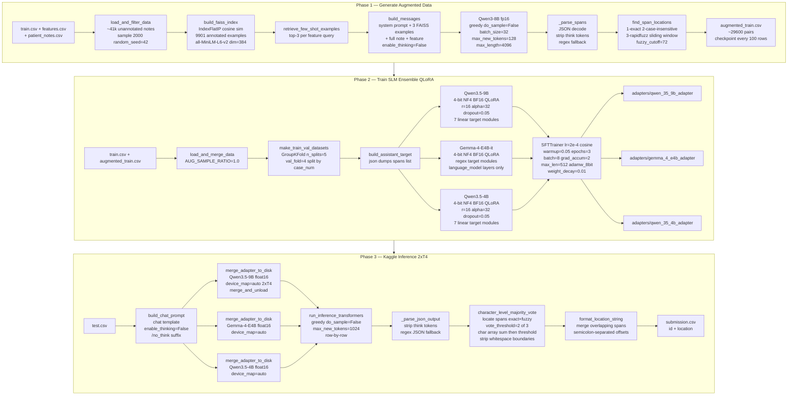

# NBME — Score Clinical Patient Notes

## Competition Overview

[NBME — Score Clinical Patient Notes](https://www.kaggle.com/competitions/nbme-score-clinical-patient-notes) is a Kaggle competition that attracted over 1,400 teams across three months. The task is **clinical span extraction**: given a patient note written by a medical student and a clinical feature from an exam rubric (e.g., "diminished appetite"), find the exact verbatim text span(s) in the note that express that feature (e.g., "eating less", "clothes fit looser").

### Input / Output Format

**Input (per row):**

- `pn_history`: free-text patient note (history section)
- `feature_text`: clinical concept from the scoring rubric
- `case_num` + `feature_num`: case/feature identifiers

**Output:**

- `location`: space-separated character offset pairs, semicolon-delimited — e.g., `"10 25;40 55"`. Empty string if the feature is absent from the note.

### Evaluation Metric

**Micro-averaged character-level F1** over all character spans across all test rows. Each predicted character offset is compared against ground-truth offsets at the character level. Precision and recall are computed globally (not per-row), then combined into F1. Top competition F1 scores reached ~0.90+ on the public leaderboard.

### Dataset Statistics

| Split            | Notes            | Annotated pairs                |
| ---------------- | ---------------- | ------------------------------ |
| Training         | ~1,000 annotated | ~9,901 (note × feature) pairs |
| Unannotated pool | ~41,000 notes    | not labeled                    |
| Test             | held-out         | evaluated by Kaggle            |

- **10 clinical cases**, each with a set of scored features
- ~2,800 notes annotated with ~35,000 phrases total
- Features per case: ~14.8 on average (2,000 × 14.8 ≈ 29,600 note-feature pairs generated in Phase 1)

---

## Our Analysis

### What Top Competitors Used

The dominant paradigm across all top solutions was **DeBERTa-based token classification**:

- **Base model**: `DeBERTa-v3-large`, `DeBERTa-v2-xlarge`, `DeBERTa-v2-xxlarge`
- **Task framing**: Named Entity Recognition (NER) / span extraction — each token in the concatenated `[note; feature]` input is assigned a BIO label; spans are decoded from contiguous B/I runs
- **Domain pretraining**: Masked Language Modeling (MLM) at mask probability 0.15 on the clinical note corpus before fine-tuning on labeled spans
- **Pseudo-labeling**: The unlabeled pool of ~41,000 notes was annotated by an initial model and added to training
- **Ensembling**: Typically 3 model variants (e.g., DeBERTa-v3-large × 10-fold + DeBERTa-v3-large × 5-fold + RoBERTa-large), predictions merged by probability averaging
- **Preprocessing**: Typo correction and medical abbreviation expansion on annotated spans improved cross-validation scores

DeBERTa's disentangled attention mechanism — which separates content and position attention — gives it an edge over standard BERT and RoBERTa on span-level tasks where positional context matters. DeBERTa-v2-xlarge and v2-xxlarge were known to occasionally collapse to zero-loss during training, requiring fold restarts.

A subsequent academic paper ([arxiv 2401.12994](https://arxiv.org/html/2401.12994v1)) using a two-phase LLM framework achieved F1 of 0.968–0.983 on the full dataset, compared to DeBERTa-based pipelines at ~0.958.

### Our Approach: Generative SLM Ensemble

This solution frames span extraction as **constrained text generation**: a small language model reads the note and feature, then outputs a JSON object containing the verbatim span strings. This contrasts with DeBERTa's per-token logit approach.

| Dimension             | Competition baseline              | This solution                                                        |
| --------------------- | --------------------------------- | -------------------------------------------------------------------- |
| Model family          | Encoder-only (DeBERTa)            | Decoder-only generative (Qwen3.5, Gemma4)                            |
| Task framing          | Token classification (BIO labels) | Structured generation (`{"spans": [...]}`)                         |
| Output representation | Per-token logits over BIO tags    | JSON string decoded from autoregressive generation                   |
| Ensemble method       | Probability averaging over folds  | Character-level majority voting across 3 models                      |
| Data augmentation     | DeBERTa pseudo-labeling           | Qwen3-8B few-shot generation with FAISS retrieval                    |
| Inference constraint  | None (unconstrained softmax)      | Per-note regex FSM (built, applied via vLLM XGrammar when available) |

The generative framing handles multiple disjoint spans naturally — the model outputs a list rather than requiring BIO decoding to stitch spans. The tradeoff is slower inference and hallucination risk, mitigated by majority voting and the regex FSM constraint.

---

## Methodology & Pipeline Overview

The solution runs in three sequential phases:

**Phase 1 — Generate Augmented Data** (`1_generate_augmented_data.ipynb`): Use `Qwen/Qwen3-8B` (fp16, greedy decoding) to pseudo-label 2,000 unannotated patient notes. FAISS-based few-shot retrieval selects 3 annotated examples per (note, feature) pair as in-context demonstrations. Output: `augmented_train.csv` with ~29,600 additional (note, feature, span) triples.

**Phase 2 — Train SLM Ensemble** (`2_train_slm_ensemble.ipynb`): Fine-tune three small language models with QLoRA (4-bit NF4, LoRA rank 16) on the combined labeled + augmented dataset. Models are trained sequentially on a single GPU, each producing a LoRA adapter (~100 MB). Output: `adapters/` containing three adapter checkpoints.

**Phase 3 — Kaggle Inference** (`3_kaggle_inference.ipynb`): Merge each LoRA adapter into its base model weights in float16, run greedy inference on the test set row-by-row, and combine predictions via character-level majority voting (threshold ≥ 2/3 models). Output: `submission.csv` with semicolon-separated character offsets.

---

## System Architecture Diagram



---

## Technical Deep Dive

### Notebook 1: Generate Augmented Data (`1_generate_augmented_data.ipynb`)

#### Objective

The competition provides ~1,000 labeled notes (9,901 annotated note-feature pairs) but ~41,000 unannotated notes. Phase 1 uses `Qwen/Qwen3-8B` as an oracle to generate pseudo-labels for 2,000 of those unannotated notes, producing ~29,600 additional training examples for Phase 2.

#### Architecture & Logic

**FAISS few-shot retrieval.** Each (note, feature) pair needs contextual examples to guide the LLM. Instead of providing all 9,901 examples in the prompt, the notebook retrieves the 3 most relevant annotated examples using cosine similarity. The embedding model is `all-MiniLM-L6-v2` (384-dimensional vectors). Each annotated example is embedded as the string `"Feature: <text>  Annotation: <text>"` and stored in a FAISS `IndexFlatIP` (inner product over L2-normalized vectors = cosine similarity). At query time, the feature text is embedded in the same format and the top-3 nearest neighbors become in-context examples.

The FAISS index (9,901 vectors, dim=384) is built once and cached to `faiss_features.index` + `faiss_metadata.parquet`. Subsequent runs load from disk in seconds.

**LLM configuration.** `Qwen/Qwen3-8B` runs in fp16. Key settings:

| Parameter               | Value       | Reason                                                                                                                                            |
| ----------------------- | ----------- | ------------------------------------------------------------------------------------------------------------------------------------------------- |
| `attn_implementation` | `"eager"` | Bypasses SDPA to avoid `CUDNN_STATUS_NOT_INITIALIZED` errors                                                                      |
| `do_sample`           | `False`   | Greedy decoding for deterministic, JSON-parseable output                                                                                          |
| `enable_thinking`     | `False`   | Suppresses Qwen3's `<think>` reasoning blocks; without this, the model outputs chain-of-thought before the JSON, consuming the 128-token budget |
| `max_new_tokens`      | 128         | Sufficient for a short JSON span list                                                                                                             |
| `max_length`          | 4096        | Accommodates system prompt + 3 few-shot examples + full clinical note                                                                             |
| `BATCH_SIZE`          | 32          | Pairs per GPU call                                                                                                                                |
| `DRAFT_MODEL`         | `None`    | Speculative decoding disabled — overhead exceeds gain for 128-token outputs                                                                      |

**Prompt structure.** Each call is a 2-message chat:

- **System**: instructs the model to extract verbatim spans only, return `{"spans": [...]}` JSON, no markdown, no explanation, no `<think>` blocks
- **User**: three FAISS-retrieved examples (note excerpt ≤300 chars + feature + answer JSON), then the full target note and feature

**Span-to-offset mapping.** The LLM outputs text strings like `"substernal pressure"`. The competition format requires character offsets like `"42 62"`. Three-step matching (most accurate first):

1. Exact substring search in `pn_history`
2. Case-insensitive exact search
3. `rapidfuzz` sliding window — tests all substrings within ±20% of the span's length, using `fuzz.ratio`; accepts matches with score ≥ 72

#### Implementation & Flow

```
main()
├── load_and_filter_data()
│   ├── load train.csv, features.csv, patient_notes.csv
│   ├── remove ~1000 already-annotated pn_nums
│   └── sample(n=2000, random_state=42) from ~41k unannotated notes
├── build_faiss_index()
│   ├── embed 9901 train examples as "Feature: X  Annotation: Y"
│   ├── IndexFlatIP(dim=384), normalize_embeddings=True
│   └── cache to faiss_features.index + faiss_metadata.parquet
├── init_llm()
│   ├── Qwen/Qwen3-8B, dtype=float16, device_map={"": "cuda:0"}
│   ├── attn_implementation="eager"
│   └── GenerationConfig(pad_token_id=eos_token_id)
└── generate_pseudo_labels()
    ├── load SentenceTransformer("all-MiniLM-L6-v2") for retrieval
    ├── _load_checkpoint() → resume from augmented_train_checkpoint.csv if exists
    ├── for each note (up to 2000):
    │   └── for each feature in that case (~14.8 avg):
    │       ├── retrieve_few_shot_examples() top-3 from FAISS
    │       ├── build_messages() 2-message chat prompt
    │       └── append to pending batch
    ├── _flush_batch() every 32 pairs:
    │   ├── apply_chat_template(enable_thinking=False)
    │   ├── tokenizer(padding=True, truncation=True, max_length=4096)
    │   ├── model.generate(do_sample=False, max_new_tokens=128)
    │   ├── _parse_spans() JSON decode, strip think tokens, regex fallback
    │   └── find_span_locations() exact → case-insensitive → rapidfuzz
    └── _save_checkpoint() atomic write every 100 rows
→ augmented_train.csv: columns id, pn_num, feature_num, case_num, annotation, location
```

The checkpoint mechanism writes atomically (write to `.tmp` then `rename()`). Interrupting and rerunning `main()` resumes from the last checkpoint by tracking completed `row_id` strings (`f"{pn_num:05d}_{feature_num:03d}"`).

**Key CONFIG values:**

| Parameter              | Value                |
| ---------------------- | -------------------- |
| `SAMPLE_SIZE`        | 2000 notes           |
| `LLM_MODEL`          | `Qwen/Qwen3-8B`    |
| `LLM_4BIT`           | `False` (fp16)     |
| `MAX_NEW_TOKENS`     | 128                  |
| `BATCH_SIZE`         | 32                   |
| `EMBED_MODEL`        | `all-MiniLM-L6-v2` |
| `TOP_K_EXAMPLES`     | 3                    |
| `FUZZY_SCORE_CUTOFF` | 72                   |
| `CHECKPOINT_EVERY`   | 100 rows             |
| `RANDOM_SEED`        | 42                   |

---

### Notebook 2: Train SLM Ensemble (`2_train_slm_ensemble.ipynb`)

#### Objective

Fine-tune three small language models with QLoRA to produce LoRA adapters that extract clinical spans via JSON generation. Training uses both the 9,901 original labeled pairs and the ~29,600 pseudo-labeled pairs from Phase 1 (`AUG_SAMPLE_RATIO=1.0`).

#### Architecture & Logic

**Model registry.** Three models are trained sequentially on a single GPU. Each is fully unloaded before the next one loads:

| Model ID                  | Size | Class                           | Adapter dir                      |
| ------------------------- | ---- | ------------------------------- | -------------------------------- |
| `Qwen/Qwen3.5-9B`       | 9B   | `AutoModelForCausalLM`        | `adapters/qwen_35_9b_adapter`  |
| `google/gemma-4-E4B-it` | 4B   | `AutoModelForImageTextToText` | `adapters/gemma_4_e4b_adapter` |
| `Qwen/Qwen3.5-4B`       | 4B   | `AutoModelForCausalLM`        | `adapters/qwen_35_4b_adapter`  |

Gemma 4 uses `AutoModelForImageTextToText` because its architecture includes a vision tower. Only language model layers are trained — LoRA target modules are specified as the regex `model\.language_model\..*\.(q_proj|k_proj|v_proj|o_proj|gate_proj|up_proj|down_proj)` rather than a list, to avoid touching `Gemma4ClippableLinear` layers which PEFT does not support.

**QLoRA quantization.** All three models are loaded in 4-bit NF4 with bfloat16 compute dtype:

```python
BitsAndBytesConfig(
    load_in_4bit=True,
    bnb_4bit_quant_type="nf4",
    bnb_4bit_compute_dtype=torch.bfloat16,
    bnb_4bit_use_double_quant=True,
    bnb_4bit_quant_storage=torch.bfloat16,
)
```

`prepare_model_for_kbit_training(use_gradient_checkpointing=True)` enables gradient checkpointing and casts LayerNorm layers to float32 for stable training on top of 4-bit weights.

**LoRA adapter settings** (Qwen3.5 models; Gemma uses regex for `target_modules`):

| Parameter          | Value                                                             |
| ------------------ | ----------------------------------------------------------------- |
| `lora_r`         | 16                                                                |
| `lora_alpha`     | 32                                                                |
| `lora_dropout`   | 0.05                                                              |
| `target_modules` | `q_proj, k_proj, v_proj, o_proj, gate_proj, up_proj, down_proj` |
| `bias`           | `"none"`                                                        |
| `task_type`      | `CAUSAL_LM`                                                     |

**Training hyperparameters** (identical across all three models):

| Parameter                       | Value                     |
| ------------------------------- | ------------------------- |
| `learning_rate`               | 2e-4                      |
| `num_train_epochs`            | 3                         |
| `per_device_train_batch_size` | 8                         |
| `gradient_accumulation_steps` | 2 → effective batch = 16 |
| `max_seq_length`              | 512 tokens                |
| `lr_scheduler_type`           | cosine                    |
| `warmup_ratio`                | 0.05                      |
| `weight_decay`                | 0.01                      |
| `optim`                       | `adamw_8bit`            |
| `eval_strategy`               | steps, every 500          |
| `save_total_limit`            | 1                         |
| `packing`                     | False                     |
| `gradient_checkpointing`      | True                      |

**Data split.** `GroupKFold(n_splits=5)` splits by `case_num` (10 cases → 5 folds of 2 cases each). `VAL_FOLD=4` is held out for validation. Splitting by case rather than by row prevents data leakage: notes from the same case share vocabulary and clinical context, so mixing cases across train/val would inflate validation scores.

**Loss function.** Standard causal language modeling cross-entropy over the full token sequence (input prompt + assistant response). The target for each example is the JSON string: `{"spans": ["verbatim span"]}` for positive examples, `{"spans": []}` for negatives. No per-token masking — loss is computed on the system prompt, user message, and assistant response jointly. This is a deliberate choice for instruction-following fine-tuning when the input context is short relative to the full sequence.

**Prompt formatting.** `make_formatting_func()` applies the tokenizer's chat template with three messages: system, user (note + feature), assistant (target JSON). Qwen3.5 models receive `enable_thinking=False` to suppress chain-of-thought tokens; Gemma has no thinking mode so the kwarg is omitted. `SFTTrainer` handles both batched (list) and unbatched (scalar) calls to the formatting function depending on TRL version.

After each model trains, only the LoRA adapter is saved via `model.save_pretrained()` — not the full quantized model weights. Adapter size is ~100 MB. VRAM is released aggressively (`del trainer, model, tokenizer; gc.collect(); torch.cuda.empty_cache()`) before the next model loads.

#### Implementation & Flow

```
main()
├── load_and_merge_data()
│   ├── train.csv (9901 pairs) + augmented_train.csv (~29600 pairs)
│   ├── AUG_SAMPLE_RATIO=1.0 → use all augmented data
│   ├── join with patient_notes.csv and features.csv for pn_history and feature_text
│   └── build assistant_target: json.dumps({"spans": annotation_list})
├── make_train_val_datasets()
│   └── GroupKFold(n_splits=5), VAL_FOLD=4, groups=case_num
└── for each model_spec in MODEL_REGISTRY (sequential):
    └── train_one_model()
        ├── skip if adapters/*/adapter_config.json already exists
        ├── build_bnb_config()                   # 4-bit NF4 BF16 double-quant
        ├── load_model_and_tokenizer()            # device_map={"": "cuda:0"}, attn="eager"
        ├── apply_lora()                          # prepare_model_for_kbit_training + get_peft_model
        ├── make_formatting_func()                # chat template with enable_thinking=False for Qwen
        ├── build_sft_config()                    # SFTConfig with all hyperparams
        ├── SFTTrainer(model, tokenizer, args, train_dataset, val_dataset, formatting_func)
        ├── trainer.train()
        ├── model.save_pretrained(adapter_dir)    # LoRA weights only ~100 MB
        ├── tokenizer.save_pretrained(adapter_dir)
        └── del trainer, model, tokenizer; gc + empty_cache
```

---

### Notebook 3: Kaggle Inference (`3_kaggle_inference.ipynb`)

#### Objective

Run on Kaggle's 2×T4 hardware (29.2 GB total VRAM, CUDA 12.8, Compute Capability 7.5 — no native bfloat16). For each model: merge the LoRA adapter into base weights, run greedy inference on all test rows, collect span predictions. Combine the three models' predictions via character-level majority voting to produce the final submission.

#### Architecture & Logic

**Hardware constraints.** T4 GPUs are CC=7.5, which has no native bfloat16 tensor cores. All inference uses `torch.float16`. The 9B model in float16 requires ~18 GB; both T4s together provide 29.2 GB, so `device_map="auto"` can spread the 9B model across both GPUs without quantization.

**Why not vLLM.** `USE_VLLM=False`. vLLM ≤0.19.1 incorrectly routes Qwen3.5 and Gemma4 (which have multimodal or hybrid architectures) to its vision-language handler, failing with `preprocessor_config.json` errors. vLLM 0.20.0+ requires CUDA 13, which the T4 environment (CUDA 12.8) does not provide. The transformers `generate()` path works on all three models.

**LoRA merge strategy.** For each model:

1. Load the base model in float16 with `device_map="auto"` (spreads across both T4 GPUs)
2. `PeftModel.from_pretrained(base_model, adapter_path)` loads the LoRA weights
3. `merge_and_unload()` folds adapter weights into base weights and returns a plain model
4. Save merged weights to `/kaggle/working/merged_models/merged_{name}/` (safe_serialization=True)
5. Load the merged model for inference, then `shutil.rmtree()` the merged checkpoint to reclaim disk

Why not use 4-bit for the merge? `merge_and_unload()` on a quantized model retains the `quantization_method` attribute, which blocks subsequent `.to(dtype)` casts. Dequantization on T4 produces bfloat16, which then errors on CC=7.5. Float16 merge bypasses both issues cleanly.

**Qwen3.5 config patch.** Some Qwen3.5 checkpoints (Unsloth-style) wrap the config as `{"model_type": "qwen3_5", "text_config": {...}}`. Transformers <5.5.0 does not recognize `qwen3_5`. The patch (`_patch_qwen35_config`):

1. Detects if `"qwen3_5" in CONFIG_MAPPING` — if yes (transformers 5.5.0+), no patch needed
2. Extracts `text_config` and renames `model_type` to `"qwen3"` (recognized in 5.0.0)
3. Creates a symlinked shadow directory under `/kaggle/working/` (since `/kaggle/input` is read-only), symlinks all weight files, and writes the patched `config.json`

**Per-note regex FSM constraint** (vLLM path, currently inactive). When vLLM is available, each test row gets a per-note `SamplingParams` with a regex built from the note's character set. The regex enforces both structural validity (`{"spans": [...]}`) and lexical containment (span strings can only contain characters from the source note). vLLM's XGrammar backend compiles this into an FSM and masks logits at each generation step — the decoder physically cannot hallucinate characters not in the note.

**Inference.** Row-by-row greedy generation with `do_sample=False`, `max_new_tokens=1024`, `pad_token_id=tokenizer.eos_token_id`. The prompt matches the Phase 2 training format exactly: same system prompt, same user message structure, plus a `/no_think` suffix in the user message and `enable_thinking=False` in the template call.

**Output parsing.** `_parse_json_output()`:

1. Strip any `<think>...</think>` blocks with `re.sub`
2. `json.loads()` on the cleaned output
3. Fallback: `re.search(r'\{.*\}', raw_text, re.DOTALL)` extracts the first JSON object if the model emitted a prefix or trailing whitespace

**Character-level majority voting.** The core ensemble step for each test row:

1. For each model's predicted span strings, locate them in `pn_history` via: exact match → case-insensitive match → `rapidfuzz.partial_ratio_alignment` (score cutoff 70)
2. Map located `(start, end)` pairs to a binary `uint8` array of length `len(pn_history)`
3. Sum the three binary arrays → vote count array (integer values 0–3)
4. Threshold at `VOTE_THRESHOLD=2`: positions with ≥ 2 votes become 1 in the consensus array
5. Zero out whitespace characters (`' ', '\t', '\n', '\r'`) at span edges (start or end of contiguous runs) to prevent spans from beginning or ending on whitespace
6. Extract contiguous runs of 1s as final `(start, end)` span tuples

Character-level voting is more robust than span-level voting: if two models predict `"substernal pressure"` and one predicts `"substernal chest pressure"`, the character overlap region still reaches the threshold vote count and is retained, rather than being discarded as a non-matching span.

**Submission formatting.** `format_location_string()`:

- Strip whitespace from span start/end boundaries
- Sort spans by start position
- Merge any overlapping or adjacent spans
- Produce `"start end;start end"` format (space within pair, semicolon between pairs)
- Rows with no predicted spans get `NaN` in the `location` column

#### Implementation & Flow

```
main()
├── load test.csv, patient_notes.csv, features.csv
│   └── build pn_map and feat_map lookup dicts
├── for each model_spec in MODEL_REGISTRY (sequential):
│   ├── merge_adapter_to_disk()
│   │   ├── _find_model_root()               # find config.json within model dir
│   │   ├── _patch_qwen35_config()           # transformers<5.5.0 compat for Qwen3.5
│   │   ├── load base model float16 device_map=auto
│   │   ├── PeftModel.from_pretrained(adapter_path)
│   │   ├── merge_and_unload()
│   │   └── save to /kaggle/working/merged_models/merged_{name}/
│   ├── AutoTokenizer.from_pretrained(merged_path)
│   ├── run_inference_transformers()
│   │   ├── load merged model float16 device_map=auto
│   │   ├── model.eval()
│   │   ├── for each test row:
│   │   │   ├── build_chat_prompt()          # enable_thinking=False, /no_think suffix
│   │   │   ├── tokenizer(prompt, return_tensors="pt")
│   │   │   ├── model.generate(do_sample=False, max_new_tokens=1024)
│   │   │   └── _parse_json_output()
│   │   └── del model; gc + empty_cache
│   ├── store model_spans in all_model_predictions
│   └── shutil.rmtree(merged_path)           # reclaim disk between models
├── character_level_majority_vote(all_model_predictions, vote_threshold=2, fuzzy_cutoff=70)
│   ├── locate_span_in_note() per model per row (exact → case-insensitive → partial_ratio_alignment)
│   ├── spans_to_char_array() → sum across 3 models
│   ├── threshold at 2 → consensus uint8 array
│   ├── zero whitespace at span edges
│   └── char_array_to_spans() → (start, end) list
├── build_submission()
│   └── format_location_string() per row → "s1 e1;s2 e2"
└── submission_df.to_csv("/kaggle/working/submission.csv")
```

**Key CONFIG values (inference):**

| Parameter                   | Value                                          |
| --------------------------- | ---------------------------------------------- |
| `USE_VLLM`                | `False`                                      |
| `VOTE_THRESHOLD`          | 2 (out of 3)                                   |
| `MAX_NEW_TOKENS`          | 1024                                           |
| `LLM_TEMPERATURE`         | 0.0 (greedy)                                   |
| `FUZZY_SCORE_CUTOFF`      | 70.0                                           |
| `LARGE_MODEL_THRESHOLD_B` | 3B (all models at/above use float16 GPU merge) |
| `dtype`                   | `torch.float16` (T4, CC=7.5)                 |
| `MAX_SPANS_PER_FEATURE`   | 10                                             |

---

## Reproducing the Pipeline

```bash
# Phase 1 — generate pseudo-labels
# Requires: features.csv, patient_notes.csv, train.csv in working directory

jupyter nbconvert --to notebook --execute 1_generate_augmented_data.ipynb

# Phase 2 — train ensemble
# Requires: augmented_train.csv from Phase 1
export HF_TOKEN=hf_...
jupyter nbconvert --to notebook --execute 2_train_slm_ensemble.ipynb

# Phase 3 — Kaggle inference
# Run inside a Kaggle notebook with T4x2 hardware, internet OFF
# Upload adapters/ as a private Kaggle dataset before running
```

**File dependencies between phases:**

```
Phase 1 output: augmented_train.csv
                faiss_features.index (cache, optional)
                faiss_metadata.parquet (cache, optional)

Phase 2 output: adapters/qwen_35_9b_adapter/adapter_config.json
                adapters/qwen_35_9b_adapter/adapter_model.safetensors
                adapters/gemma_4_e4b_adapter/adapter_config.json
                adapters/gemma_4_e4b_adapter/adapter_model.safetensors
                adapters/qwen_35_4b_adapter/adapter_config.json
                adapters/qwen_35_4b_adapter/adapter_model.safetensors

Phase 3 output: /kaggle/working/submission.csv
```
