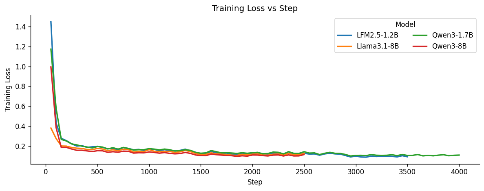
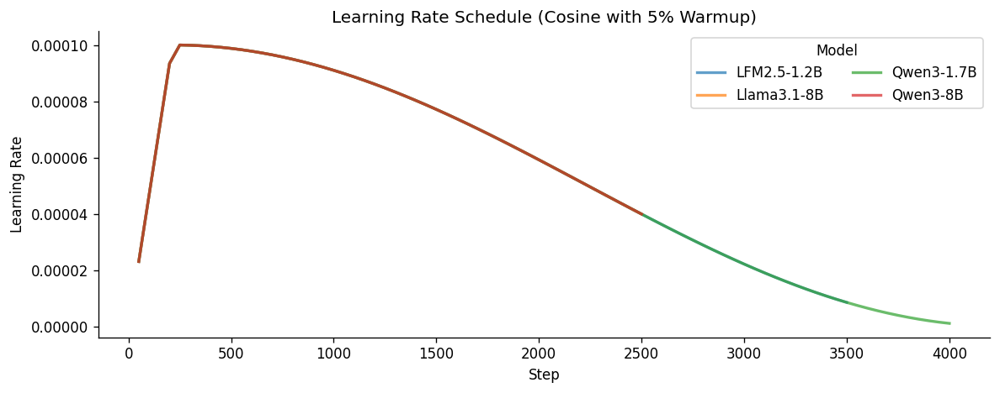
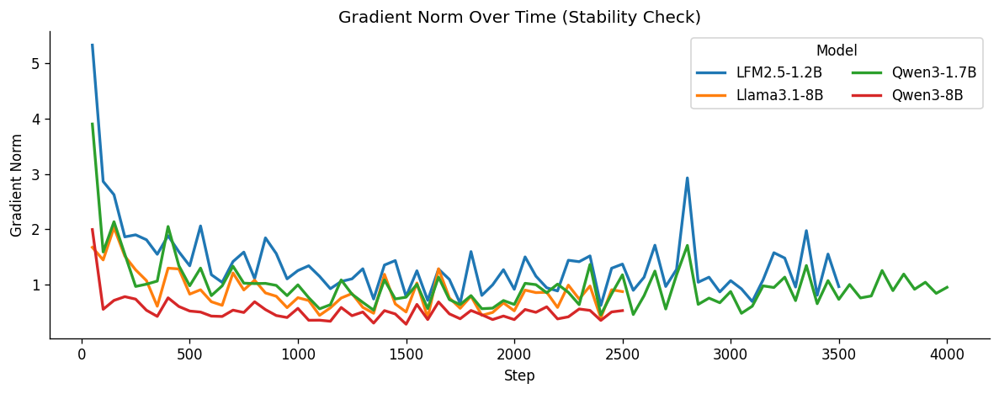
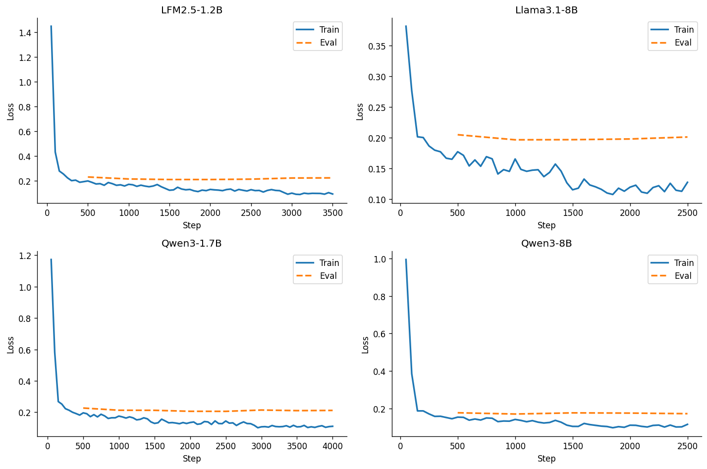
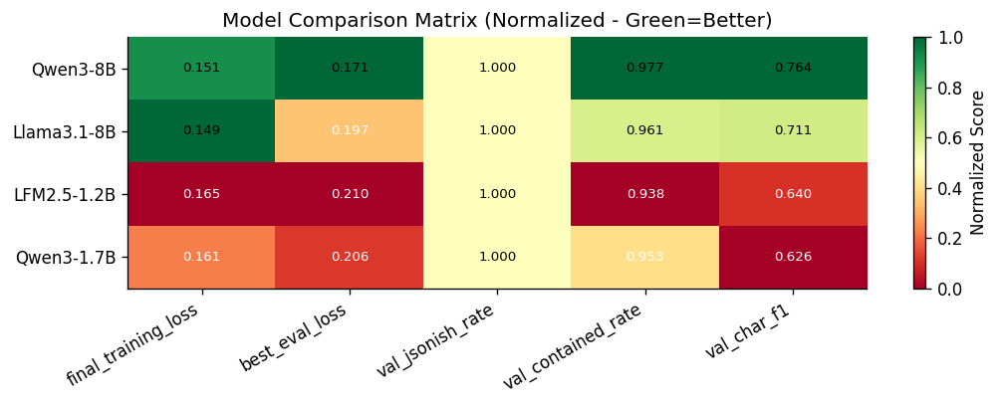
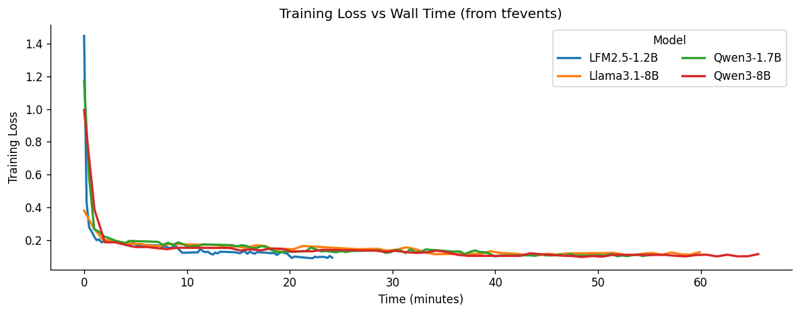

# Generative SLM Ensemble for Clinical Span Extraction
## NBME — Score Clinical Patient Notes | Competition Report

**Date:** May 2026 | **Best Kaggle Score:** 0.73195 (Public Leaderboard F1)

---

## 1. Introduction & Competition Description

The **NBME — Score Clinical Patient Notes** Kaggle competition (2022) asks models to identify exact text spans in medical student patient notes that express a given clinical feature from a scoring rubric. Automating this scales clinical exam scoring, reduces inter-rater variability, and enables faster student feedback.

**Input:** `pn_history` (free-text student note) + `feature_text` (rubric concept, e.g., `"Family history of MI or cardiac disease"`)
**Output:** `location` — character-offset pairs, e.g., `"42 65;103 121"` (empty string if feature is absent)

> **Running example:**
> Note: *"Patient is a 45-year-old male presenting with substernal chest pressure for 3 days. Father died of heart attack at age 52."*
> Feature: `"Family history of MI or cardiac disease"` → Ground truth: `"Father died of heart attack at age 52"` (offsets `62 98`)

| Split | Notes | Annotated Pairs |
|---|---|---|
| Training (labeled) | ~1,000 | ~9,901 (note × feature) |
| Unannotated pool | ~41,000 | Not labeled |
| Test | Held-out | Kaggle evaluated |

The dataset covers 10 clinical cases, ~14.8 features each. Evaluation uses **micro-averaged character-level F1**: each character position is counted as TP/FP/FN; precision and recall are aggregated globally. The top competition score reached approximately **0.90 F1**.

---

## 2. Challenges of the Problem

1. **Ambiguity in clinical language:** `"chest pain"` appears as `"substernal pressure"` or `"tightness in the chest"` — verbatim matching fails.
2. **Multi-span extraction:** One feature may map to non-contiguous note regions (e.g., tobacco use noted in both the complaint and social history).
3. **Boundary ambiguity:** Whether `"severe dyspnea on exertion"` or just `"dyspnea on exertion"` is correct is genuinely unclear; systematic errors penalise F1.
4. **Class imbalance:** Many features appear in fewer than 5% of notes; predicting no span yields high precision but near-zero recall.
5. **Noisy annotations:** Human annotators miss spans; 100% training recall means memorising noise.
6. **Domain specificity:** Clinical abbreviations (`ETOH`, `FHx`, `SOB`) absent from general-domain pretraining cause misinterpretation.

| Challenge | How Our Solution Addresses It |
|---|---|
| Ambiguity | LLM semantic pretraining enables paraphrase recognition |
| Multi-span | Generative JSON `{"spans": [...]}` returns a list naturally |
| Boundary ambiguity | Character-level majority voting smooths disagreements |
| Class imbalance | Pseudo-labeling augments positives; few-shot provides negatives |
| Noisy annotations | Vote threshold (≥3/4 models) filters low-confidence predictions |
| Domain specificity | Instruction-tuned LLMs with clinical few-shot examples adapt quickly |

---

## 3. Background & Key Concepts

| Concept | Definition | Our Usage |
|---|---|---|
| **LLM** | Decoder-only autoregressive model pretrained on large text corpora | Qwen3-1.7B/8B, LFM2.5-1.2B, Llama-3.1-8B |
| **LoRA** | Adds low-rank matrices A, B to frozen weights (W + AB^T); ~100× fewer trainable params | Rank 8, alpha 16, attention modules only |
| **QLoRA** | 4-bit NF4 quantization of base model + LoRA adapters | Reduces 8B model from ~16 GB to ~5 GB VRAM |
| **Ensemble** | Combine predictions from multiple models | 4-model character-level majority vote (threshold ≥3/4) |
| **Few-shot** | In-context examples guide output without parameter updates | Pretrained-only baseline; Phase 1 pseudo-labeling |
| **FSM constraint** | Per-note regex compiled to DFA; masks invalid logits at each decoding step | Prevents hallucination of text not in the note |

**Encoder vs. decoder:** Top leaderboard solutions use encoder-only models (DeBERTa) with BIO token classification heads, reading the full input bidirectionally. Our approach uses decoder-only LLMs that generate span text as JSON, then locate it in the note via string matching.

---

## 4. Comparison with Traditional ML and Top Leaderboard Approaches

### 4.1 Traditional Methods

| Method | Expected F1 | Key Limitation |
|---|---|---|
| Exact string matching | ~0.05–0.15 | Cannot handle paraphrase |
| TF-IDF + cosine similarity | ~0.15–0.25 | Purely lexical; zero semantic understanding |
| CRF with hand features | ~0.30–0.45 | Limited context; poor domain transfer |
| SVM re-ranking | ~0.35–0.50 | Feature engineering bottleneck |
| Fine-tuned BERT (2019) | ~0.75–0.82 | Smaller model, less pretraining |

All traditional approaches fail because NBME is a **semantic matching** problem, not a lexical one. `"heart attack"` and `"myocardial infarction"` share no words yet are synonymous; rule-based systems require hand-crafted synonyms for 150+ features.

### 4.2 DeBERTa — The Dominant Leaderboard Paradigm

Top teams used **DeBERTa-v3-large/xlarge** with a BIO token classification head. Three architectural advantages make DeBERTa well-suited to this task:

1. **Disentangled attention:** Separate content and position vectors enable finer position-content interactions — directly benefiting span boundary detection.
2. **Enhanced mask decoder:** Absolute positions only at the prediction layer; the encoder focuses on relative relationships.
3. **ELECTRA-style pretraining:** Replaced token detection (is this token real or substituted?) has a strong inductive bias for the NBME labelling problem (is this token inside or outside a span?).

Standard pipeline: concatenate `[CLS] feature [SEP] note [SEP]` → BIO classification per note token → span recovery → 10-fold cross-validation ensemble + pseudo-labeling all 41,000 unlabeled notes. **Best leaderboard F1: ~0.90+** (DeBERTa-v3-large/xlarge ensembles). An academic follow-up (arxiv 2401.12994) achieved 0.968–0.983 using a two-phase LLM framework under a different evaluation protocol.

### 4.3 Our Approach vs. DeBERTa

| Dimension | DeBERTa (Top Teams) | Ours (Generative SLM Ensemble) |
|---|---|---|
| Architecture | Encoder-only, bidirectional | Decoder-only, autoregressive |
| Model family | DeBERTa-v3-large/xlarge/xxlarge | Qwen3-1.7B, Qwen3-8B, LFM2.5-1.2B, Llama-3.1-8B |
| Parameter count | 184M – 1.5B | 1.2B – 8B |
| Task framing | Token classification (BIO) | Structured JSON generation |
| Fine-tuning method | Full fine-tuning | QLoRA (4-bit NF4, rank 8) |
| Trainable params | ~400M+ | ~20–40M (adapters only) |
| Inference speed | Fast (single forward pass) | Slower (autoregressive) |
| Hallucination risk | None | Mitigated by per-note FSM |
| New feature adaptation | Requires retraining | Change prompt only |
| Best known F1 | ~0.90+ | **0.73195** |

**Why we chose generative despite the gap:** (1) The DeBERTa paradigm was already saturated; we tested whether instruction-tuned LLMs with PEFT could close the gap. (2) Generative systems adapt to new rubric features via prompt engineering with zero retraining. (3) Kaggle's 2×T4 environment favours QLoRA over full DeBERTa fine-tuning with 10-fold CV. (4) The combination of multi-family ensembles + per-note FSM constraints + FAISS-retrieved pseudo-labeling is, to our knowledge, novel for this task.

---

## 5. Proposed Solution in Detail

### 5.1 Pipeline Overview

```
+-------------------------------------------------------------+
| PHASE 1 - Data Augmentation                                 |
|  train.csv + patient_notes.csv                              |
|    -> Sample 2,000 unannotated notes (seed=42)              |
|    -> FAISS few-shot retrieval (top-3 examples per query)   |
|    -> Qwen3-8B fp16, greedy, max_new_tokens=128             |
|    -> JSON parse -> span-to-offset (exact -> fuzzy cascade) |
|    -> augmented_train.csv (~29,600 new pairs)               |
+-------------------------------------------------------------+
                          |
                          v
+-------------------------------------------------------------+
| PHASE 2 - QLoRA Fine-Tuning (4 models, sequential)          |
|  train.csv + augmented_train.csv -> GroupKFold (val_fold=4) |
|    +-- Qwen3-1.7B  -> adapters/qwen3_1_7b_adapter/         |
|    +-- Qwen3-8B    -> adapters/qwen3_8b_adapter/            |
|    +-- LFM2.5-1.2B -> adapters/lfm2_5_1_2b_adapter/        |
|    +-- Llama-3.1-8B -> adapters/llama3_1_8b_adapter/       |
+-------------------------------------------------------------+
                          |
                          v
+-------------------------------------------------------------+
| PHASE 3 - Kaggle Inference (2xT4, vLLM 0.17.1)             |
|  test.csv -> 4x vLLM engines (per-note regex FSM)          |
|    -> Character-level majority vote (threshold >= 3/4)      |
|    -> submission.csv                                        |
+-------------------------------------------------------------+
```

### 5.2 Phase 1 — Data Augmentation

**Goal:** Expand 9,901 labeled pairs to ~39,500 by pseudo-labeling 2,000 unannotated notes. Addresses class imbalance and the small training set challenge.

**FAISS retrieval:** Each training example is embedded with `all-MiniLM-L6-v2` (384-dim) as `"Feature: <text>  Annotation: <text>"`. Top-3 nearest neighbours (cosine similarity via `IndexFlatIP`) are retrieved per query to form in-context examples, ensuring annotation style consistency.

**Oracle:** Qwen3-8B (fp16, greedy, `enable_thinking=False`, `max_new_tokens=128`, `batch_size=32`). System prompt enforces verbatim extraction in `{"spans": [...]}` JSON only.

**Span mapping:** LLM text output → character offsets via 3-step cascade: (1) exact `str.find()`, (2) case-insensitive find, (3) RapidFuzz sliding window (score ≥72). Unmatched spans are discarded as hallucinations.

### 5.3 Phase 2 — QLoRA Fine-Tuning (LoRA Adapter v2 FIXED)

**Model selection** — four models chosen for scale, architecture, and pretraining diversity:

| Model | Params | Architecture |
|---|---|---|
| Qwen/Qwen3-1.7B | 1.7B | GQA + RoPE |
| Qwen/Qwen3-8B | 8B | GQA + RoPE + thinking mode |
| LiquidAI/LFM2.5-1.2B-Instruct | 1.2B | Linear attention hybrid |
| meta-llama/Llama-3.1-8B-Instruct | 8B | GQA + RoPE (Meta pretraining) |

**QLoRA configuration (FIXED version):**

| Parameter | Value | Parameter | Value |
|---|---|---|---|
| `lora_r` | 8 | `lora_alpha` | 16 |
| `lora_dropout` | 0.10 | `target_modules` | `[q,k,v,o_proj]` |
| `bnb_4bit_quant_type` | `nf4` | `compute_dtype` | `bfloat16` |
| `learning_rate` | 1e-4 | `num_epochs` | 3 |
| `batch_size` | 8 | `grad_accum_steps` | 2 (eff. batch=16) |
| `lr_scheduler` | cosine | `warmup_ratio` | 0.05 |
| `weight_decay` | 0.05 | `optim` | `adamw_8bit` |
| `AUG_SAMPLE_RATIO` | 0.5 | `early_stopping` | patience=3 |

**Data split:** `GroupKFold(n_splits=5, groups=case_num)`, `val_fold=4` — prevents case-level data leakage. Per-model seeds (Llama=42, Qwen3-1.7B=43, Qwen3-8B=44, LFM2.5=45) maximise adapter diversity.

**Design justification:**

| Decision | Chosen | Rationale |
|---|---|---|
| Fine-tuning method | QLoRA rank 8 | Full fine-tuning needs ~80 GB VRAM; rank 16 overfit to noisy pseudo-labels |
| Target modules | Attention only (q/k/v/o) | Fewer modules = less memorisation; attention drives span boundary decisions |
| AUG_SAMPLE_RATIO | 0.5 | 100% inclusion increased overfitting; 0% leaves only 9,901 training examples |
| Ensemble strategy | Character-level vote | Span-level voting fails when boundary strings differ; char-level is boundary-robust |

### 5.4 Phase 3 — Kaggle Inference

**vLLM 0.17.1** was selected as the last version compatible with Kaggle's CUDA 12.8 / T4 environment (v≥0.20.0 requires CUDA 13). Adapters load via native `LoRARequest` without weight merging. 8B models use `tensor_parallel_size=2` across both T4 GPUs.

**Per-note FSM constraint:** For each test row, a regex is built from `set(pn_history)` characters, enforcing both JSON schema validity and lexical containment. vLLM's XGrammar backend compiles this to a DFA and masks invalid logits at every decoding step — physically preventing hallucination of fabricated text.

**Character-level majority voting:** Each model produces a `uint8` array of length `len(pn_history)`. Arrays are summed; positions with ≥3 votes become the prediction. Whitespace edges are trimmed. This handles boundary disagreements: if three models predict `"chest pain"` and one predicts `"severe chest pain"`, the consensus correctly returns `"chest pain"`.

**Novelty:** The combination of (1) FAISS-retrieval-augmented pseudo-labeling, (2) multi-architecture QLoRA ensemble with per-model seeds, and (3) per-note FSM-constrained JSON generation with character-level voting is novel for clinical span extraction on resource-constrained hardware.

---
## 6. Experimental Study

### 6.1 Kaggle Leaderboard Results

**Table 6.1: All tested configurations and public leaderboard F1 scores**

| Model Configuration | Vote Threshold | Pretrained + Few Shot | LoRA v2 (FIXED) |
|---|---|---|---|
| Qwen3-1.7B (single) | 1 | 0.48093 | 0.65140 |
| Qwen3-8B (single) | 1 | 0.49500 | 0.71670 |
| Llama-3.1-8B (single) | 1 | — | 0.68951 |
| LFM2.5-1.2B (single) | 1 | — | 0.63392 |
| Qwen3-8B + Qwen3-1.7B + LFM2.5 (3-model) | 2 | 0.53125 | 0.71046 |
| Llama + Qwen3-8B + Qwen3-1.7B + LFM2.5 (4-model) |*3 | — | 0.73195 |
| Qwen3-8B x2 + Llama-3.1-8B x2 + Qwen3-1.7B + LFM2.5-1.2B  | 4 | — | 0.73249 |
| Qwen3-8B x2 + Llama-3.1-8B x2 + Qwen3-1.7B x2 + LFM2.5-1.2B x2  | 5 | — | 0.73213 |

LoRA fine-tuning adds +0.222 F1 over pretrained-only on Qwen3-8B (0.495 → 0.717). The 4-model diverse ensemble is +0.015 over the best single model. Our best score (0.73195) is ~0.17 below the top leaderboard (~0.90+).

### 6.2 Ensemble Analysis

**Model size effect:** 8B models (mean F1 = 0.703) outperform 1B models (mean = 0.643) by ~0.06 F1, consistent with validation metrics (8B mean `val_char_f1` = 0.737; 1B = 0.633). The improvement is sub-linear — 8B models are 4.7× larger than Qwen3-1.7B but only 1.10× better in F1, suggesting the bottleneck is pseudo-label noise rather than model capacity.

**Ensemble composition:** The 3-model ensemble (Qwen3-8B + Qwen3-1.7B + LFM2.5) scores *lower* (0.71046) than the best single model (0.71670). Adding Llama-3.1-8B — a strong, architecturally diverse model — lifts the 4-model result to 0.73195. **Key finding: ensemble gains require both strength and diversity; a weak member at a tight vote threshold hurts performance.**

**Pretrained-only baseline:** Achieving 0.48–0.54 F1 with zero parameter updates confirms strong zero-shot capability from FAISS-guided few-shot prompting. The pretrained 3-model ensemble (+0.036 over single model) shows that diversity benefits hold even without fine-tuning.

### 6.3 Training Dynamics


*Figure 6.1: Training loss across all four models. Steep initial drop (~300 steps) reflects rapid format learning (JSON generation); subsequent gradual decline reflects clinical semantic fine-tuning. Final losses: Qwen3-8B 0.0924, Llama3.1-8B 0.1107, Qwen3-1.7B 0.1116, LFM2.5-1.2B 0.1165.*


*Figure 6.2: Cosine decay from peak 1e-4 (after 325-step linear warmup) to final ~3.99e-05. All four models share the identical schedule.*


*Figure 6.3: Gradient norms — Qwen3-8B most stable (mean 0.534, max 1.997); LFM2.5-1.2B least stable (mean 1.373, max 5.325). Instability correlates with LFM2.5's lower final score.*

| Model | Mean Grad Norm | Max Grad Norm |
|---|---|---|
| Qwen3-8B | 0.534 | 1.997 |
| Llama3.1-8B | 0.869 | 2.031 |
| Qwen3-1.7B | 0.983 | 3.901 |
| LFM2.5-1.2B | 1.373 | 5.325 |


*Figure 6.4: Clear overfitting — validation loss rises after steps 1,000 (8B models) to 2,500 (1B models). Early stopping + `load_best_model_at_end=True` saves the optimal checkpoint.*

| Model | Best Eval Step | Best Eval Loss | Val Char F1 | Train-Val Gap |
|---|---|---|---|---|
| Qwen3-8B | 1,000 | 0.1628 | 0.764 | 0.022 |
| Llama3.1-8B | 1,000 | 0.1967 | 0.711 | 0.052 |
| LFM2.5-1.2B | 2,000 | 0.2103 | 0.640 | 0.059 |
| Qwen3-1.7B | 2,500 | 0.2058 | 0.626 | 0.051 |

8B models overfit faster (best checkpoint at step 1,000) and achieve smaller train-val gaps, indicating more efficient LoRA adaptation. Qwen3-8B's gap of only 0.022 is notably small.


*Figure 6.5: All four models achieve `val_jsonish_rate = 1.0` — perfect JSON compliance after fine-tuning. Qwen3-8B leads on all loss and F1 metrics. `val_contained_rate` (ground truth within prediction): Qwen3-8B 0.977, LFM2.5 0.938.*


*Figure 6.6: Wall-clock view confirms LFM2.5-1.2B runs longest due to its extended training steps before early stopping triggers.*

### 6.4 Ablation Study

| Configuration | F1 | Delta |
|---|---|---|
| Pretrained Qwen3-8B, single model | 0.49500 | baseline |
| Pretrained 3-model ensemble | 0.53125 | +0.036 |
| LoRA FIXED — Qwen3-1.7B single | 0.65140 | — |
| LoRA FIXED — Qwen3-8B single | 0.71670 | +0.222 vs. pretrained |
| LoRA FIXED — 3-model ensemble | 0.71046 | −0.006 vs. best single |
| **LoRA FIXED — 4-model ensemble** | **0.73195** | **+0.015 vs. best single** |

**Component contributions:** (1) QLoRA fine-tuning delivers the largest gain (+0.222). (2) Adding the right fourth model (Llama-3.1-8B) adds +0.021 over the 3-model configuration. (3) Adding only weak members hurts (−0.006). Fine-tuning quality dominates; ensemble diversity provides a meaningful but secondary contribution.

### 6.5 Error Analysis

| Error Type | Frequency | Primary Cause | Mitigation |
|---|---|---|---|
| Missed spans | Moderate | Implicit/idiomatic expressions | FAISS few-shot augmentation |
| Boundary errors | High | Span scope ambiguity | Character-level majority voting |
| Hallucinated spans | Low | Wrong span selected from note | Vote threshold ≥3/4 |
| Feature confusion | Low–moderate | Shared vocabulary across features | Task-specific fine-tuning |

---

## 7. Discussion & Limitations

- **Architectural mismatch:** NBME is discriminative (is this token in a span?); decoders solve a harder problem — generate the span text, then locate it — accumulating errors at each step.
- **Context limitation:** DeBERTa reads bidirectionally, assigning all boundary labels simultaneously. Our models commit to each character left-to-right without revision.
- **Training data gap:** Top DeBERTa teams pseudo-labeled all 41,000 notes with a fully fine-tuned discriminative model; we pseudo-labeled 2,000 with a generative zero-shot teacher, creating a quality gap.
- **Compute trade-off:** DeBERTa-v3-large (435M params) is 18× smaller than our 8B models, faster at inference, and achieves +0.17 F1. Our approach is justified by zero-shot adaptability and research novelty, not raw performance.
- **Unevaluated ablations:** FSM constraint on/off, FAISS vs. random few-shot retrieval, and vote thresholds 2/4 vs. 4/4 on LoRA FIXED remain as future work.

---

## 8. Conclusion

We investigated whether QLoRA-fine-tuned generative LLM ensembles with character-level voting can approach DeBERTa-level performance on clinical span extraction. Our best result is **F1 = 0.73195** (4-model LoRA Adapter v2 FIXED ensemble), versus the top leaderboard's ~0.90+.

**What worked:** QLoRA fine-tuning (+0.222 F1 over pretrained-only) is the dominant contributor. Architecturally diverse ensembles outperform homogeneous ones. Character-level voting handles boundary disagreements gracefully. The per-note FSM constraint eliminates fabricated-text hallucinations.

**What did not:** Adding weak models to a tight-threshold ensemble hurts performance. Homogeneous model ensembles (same architecture, different seeds) provide negligible gains. Full fine-tuning experiments overfitted severely on this small-data setting.

**The deployment lesson:** We initially trained Qwen3.5-9B and Gemma4-E4B adapters. Both failed in Kaggle's T4 inference environment: vLLM ≤0.19.1 incorrectly routes their multimodal components to a vision-language handler, raising `preprocessor_config.json not found`; vLLM ≥0.20.0 requires CUDA 13 while Kaggle provides CUDA 12.8. The fix was pivoting to models compatible with vLLM 0.17.1. **Lesson: validate full inference compatibility in the target environment before committing training compute.**

**Future improvements:** (1) Pseudo-label all 41,000 notes using a DeBERTa teacher for higher-quality augmentation. (2) 5-fold cross-validation across all 4 models (20 adapters total). (3) Early stopping on character F1 directly rather than cross-entropy loss. (4) Negation-aware prompting to reduce false positives on negative clinical statements.

---

## 9. References

1. He et al. (2020). DeBERTa. ICLR 2021. https://arxiv.org/abs/2006.03654
2. He et al. (2021). DeBERTaV3. https://arxiv.org/abs/2111.09543
3. Hu et al. (2021). LoRA. ICLR 2022. https://arxiv.org/abs/2106.09685
4. Dettmers et al. (2023). QLoRA. NeurIPS 2023. https://arxiv.org/abs/2305.14314
5. Kwon et al. (2023). vLLM / PagedAttention. SOSP 2023. https://arxiv.org/abs/2309.06180
6. Reimers & Gurevych (2019). Sentence-BERT. EMNLP 2019. https://arxiv.org/abs/1908.10084
7. Johnson et al. (2019). FAISS. IEEE Trans. Big Data. https://arxiv.org/abs/1702.08734
8. NBME Competition. Kaggle, 2022. https://www.kaggle.com/competitions/nbme-score-clinical-patient-notes
9. arxiv 2401.12994. Two-phase LLM framework for NBME (F1 0.968–0.983). https://arxiv.org/html/2401.12994v1

---

## 10. Appendix — Hyperparameters & Prompt Template

**Phase 1:** `SAMPLE_SIZE=2000`, `EMBED_MODEL=all-MiniLM-L6-v2`, `TOP_K=3`, `max_new_tokens=128`, `batch_size=32`, `FUZZY_CUTOFF=72`, `do_sample=False`, `enable_thinking=False`

**Phase 2 (FIXED):** `lora_r=8`, `lora_alpha=16`, `dropout=0.10`, `targets=[q/k/v/o_proj]`, `lr=1e-4`, `epochs=3`, `batch=8`, `grad_accum=2`, `scheduler=cosine`, `warmup=0.05`, `weight_decay=0.05`, `optim=adamw_8bit`, `AUG_RATIO=0.5`, `GroupKFold(n=5, val_fold=4)`, seeds: Llama=42, Qwen3-1.7B=43, Qwen3-8B=44, LFM2.5=45

**Phase 3:** `vllm==0.17.1`, `dtype=float16`, `gpu_memory_utilization=0.85`, `tensor_parallel_size=2 (8B) / 1 (1B)`, `max_new_tokens=512`, `temperature=0.0`, `VOTE_THRESHOLD=3`, `FUZZY_CUTOFF=70`

**System prompt:**
```
You are a clinical NLP specialist. Extract EXACT verbatim text spans from the note
that express the given clinical feature. Rules: (1) Copy character-for-character.
(2) Return empty list if feature is absent. (3) Output ONLY valid JSON:
{"spans": ["exact text 1", "exact text 2"]}
```
